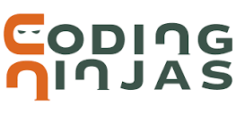

# Coding-ninjas

This repository is for solutions for coding ninjas C++ interview batch questions. Feel free to have some idea from the codes. Disclaimer: The getting started module question I have left out, because those are basics. If you want answers for further modules, go ahead. :)
